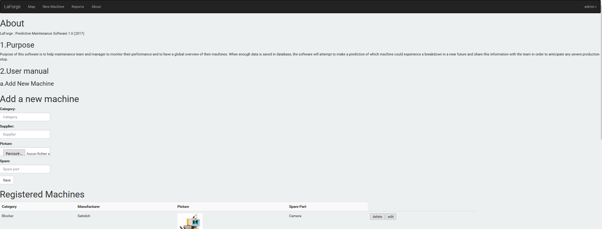
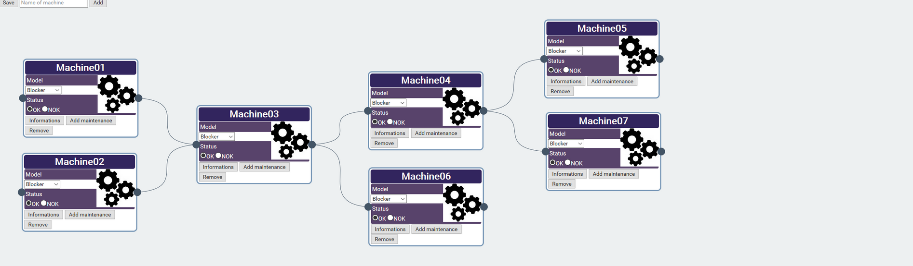

# La Forge

> **Note:** This project was previously abandoned but has been revived with updated dependencies and modern Django practices.

## Overview

La Forge is a web-based Factory Management System (FMS) that helps you design, monitor, and optimize your manufacturing process lines through predictive maintenance. Named after Star Trek's chief engineer Geordi La Forge, this application combines real-time monitoring with machine learning to prevent equipment failures before they occur.

## Key Features

- **Visual Factory Design**
  - Interactive drag-and-drop interface to design your factory layout
  - Create and manage machine categories and configurations
  - Document machine relationships and dependencies

- **Maintenance Management**
  - Track maintenance activities and schedules
  - Manage spare parts inventory and suppliers
  - Record machine downtimes and failure patterns

- **Predictive Maintenance**
  - Machine learning algorithms analyze maintenance history
  - Predict potential equipment failures
  - Recommend optimal maintenance schedules
  - Reduce unplanned downtime and maintenance costs

- **Reporting & Analytics**
  - Real-time equipment status monitoring
  - Maintenance performance metrics
  - Resource utilization reports
  - Cost analysis and optimization

## Tech Stack

- Django 3.2 (LTS)
- Django REST Framework
- SQLite Database
- Bootstrap for responsive UI
- jQuery and jsPlumb for interactive diagrams

## Screenshots

### Factory Layout Designer


### Maintenance Dashboard


## Getting Started

1. Clone the repository
2. Install dependencies:
   ```bash
   pip install -r requirements.txt
   ```
3. Run migrations:
   ```bash
   python manage.py migrate
   ```
4. Create a superuser:
   ```bash
   python manage.py createsuperuser
   ```
5. Start the development server:
   ```bash
   python manage.py runserver
   ```

## Contributing

While this project was previously abandoned, contributions are now welcome! Feel free to submit issues and pull requests.

## License

This project is licensed under the MIT License - see the LICENSE file for details.